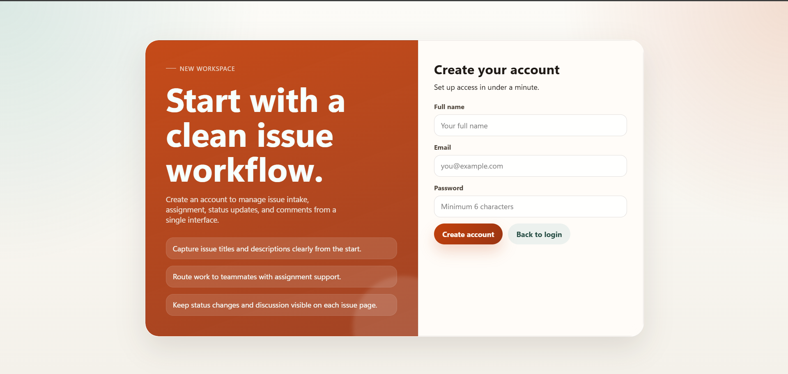
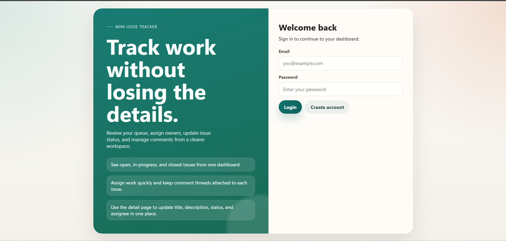
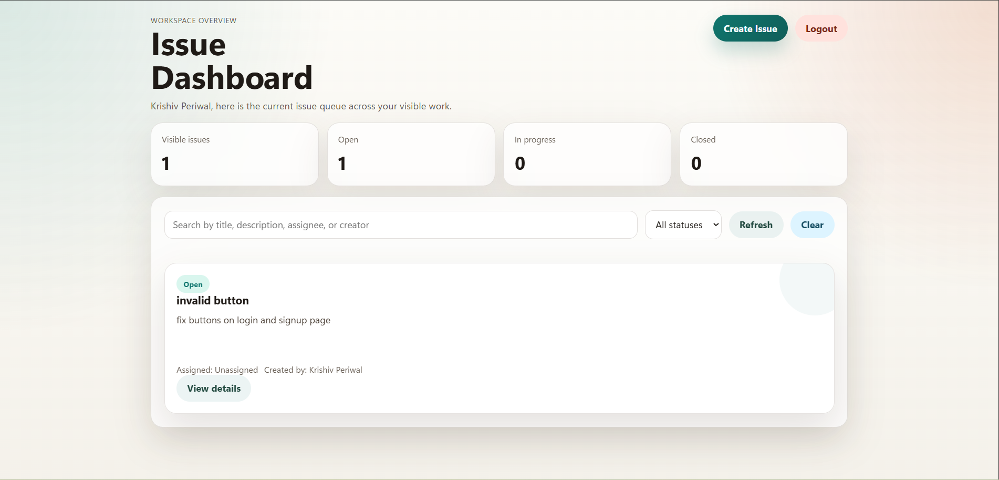
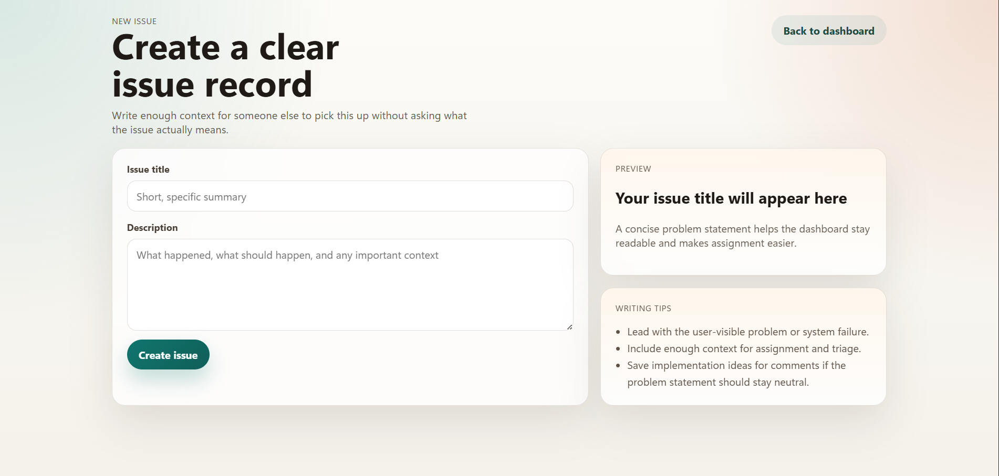
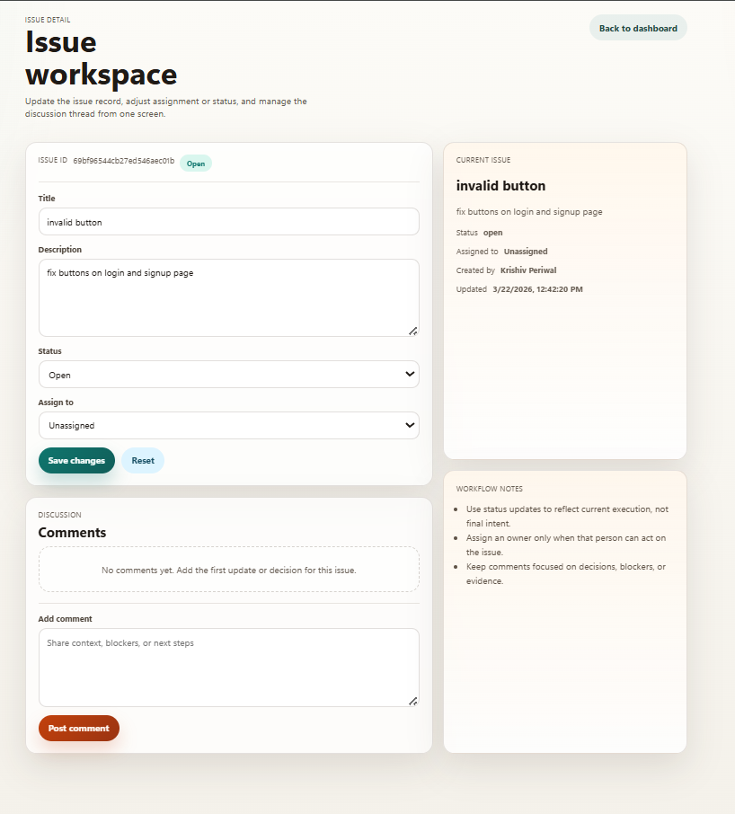

# 🛠 Role-Based Issue Tracking API

A production-style backend system for managing issues with role-based access control, permissions, and comment tracking.

---

## ❗ Problem

Managing issues or bugs across teams becomes unstructured without a centralized system.

This API provides a secure and structured backend solution to create, assign, update, and track issues with proper access control and collaboration features.

---

## 🔗 Key Features

* 🔐 JWT-based Authentication with secure password hashing (bcrypt)
* 🧑‍💼 Role-Based Access Control (RBAC) for users and admins
* 🛡 Permission-based issue modification (creator/assignee control)
* 📋 Full CRUD operations for issues
* 🔄 Issue lifecycle management (open, in-progress, closed)
* 👥 Issue assignment system
* 💬 Comment system linked to issues
* ⚡ Filtering by status and user
* 🚀 Optimized queries using MongoDB indexing
* 🛠 Centralized error handling with custom error class

---

## ⚙️ Tech Stack

* Node.js
* Express.js
* MongoDB (Mongoose)
* JWT Authentication
* EJS (for views)

---

## 🏗 Architecture

Follows a modular backend architecture:

* Controllers → Business logic
* Models → Database schemas
* Routes → API endpoints
* Middleware → Auth, Roles, Permissions, Errors
* Utils → Async handler & custom error class

---

## 📡 API Endpoints

### Auth

* POST `/api/auth/signup`
* POST `/api/auth/login`
* GET `/api/auth/users`

### Issues

* POST `/api/issues`
* GET `/api/issues`
* PUT `/api/issues/:id`

### Comments

* POST `/api/issues/:issueId/comments`
* GET `/api/issues/:issueId/comments`
* DELETE `/api/issues/comments/:commentId`

---

## 📦 Sample Response

GET /api/issues

```json
[
  {
    "title": "Fix login bug",
    "status": "in-progress",
    "createdBy": "user_id",
    "assignedTo": "user_id",
    "createdAt": "2026-03-21"
  }
]
```

---

## 🛠 Run Locally

```bash
git clone <your-repo-link>
cd mini-issue-tracker
npm install
npm run start
```

Create a `.env` file using `.env.example`

---

## 📸 Preview

### Signup


### Login


### Dashboard


### Create Issue


### Issue Workspace


---

## �📌 API Base URL

http://localhost:5000/api

---

## 👨‍💻 Author

Krishiv
"# role-based-issue-tracking-api" 
